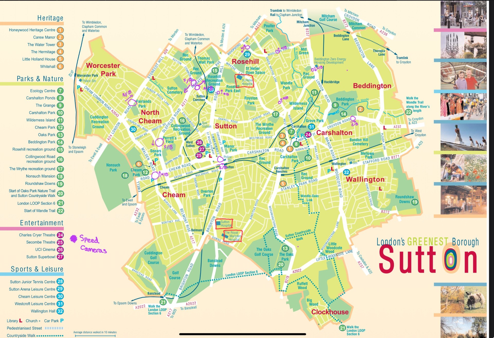
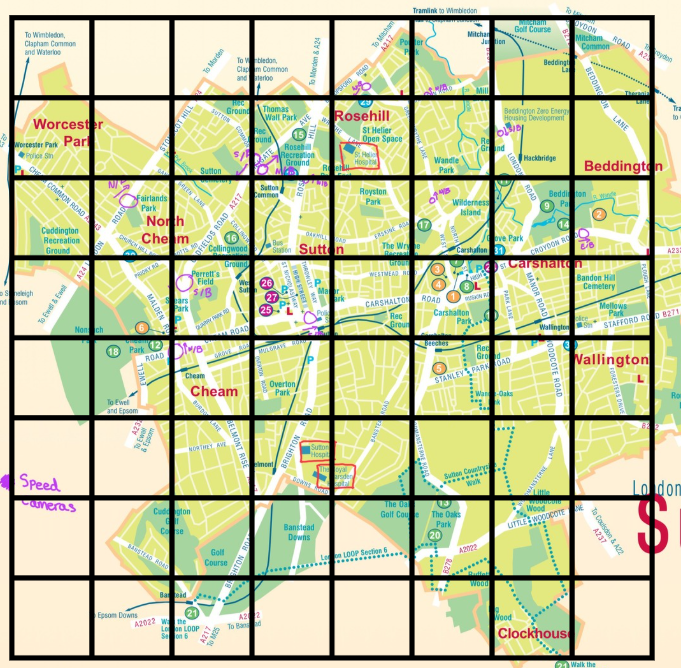
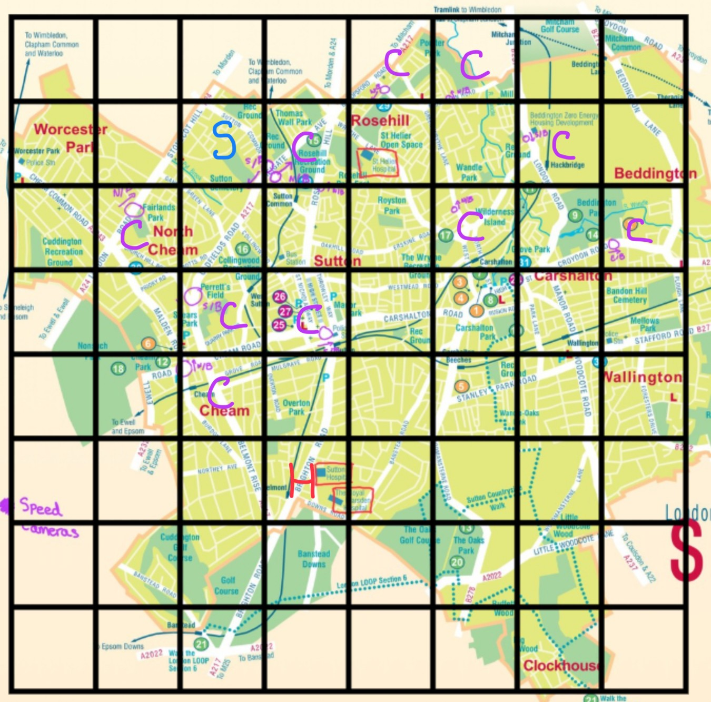
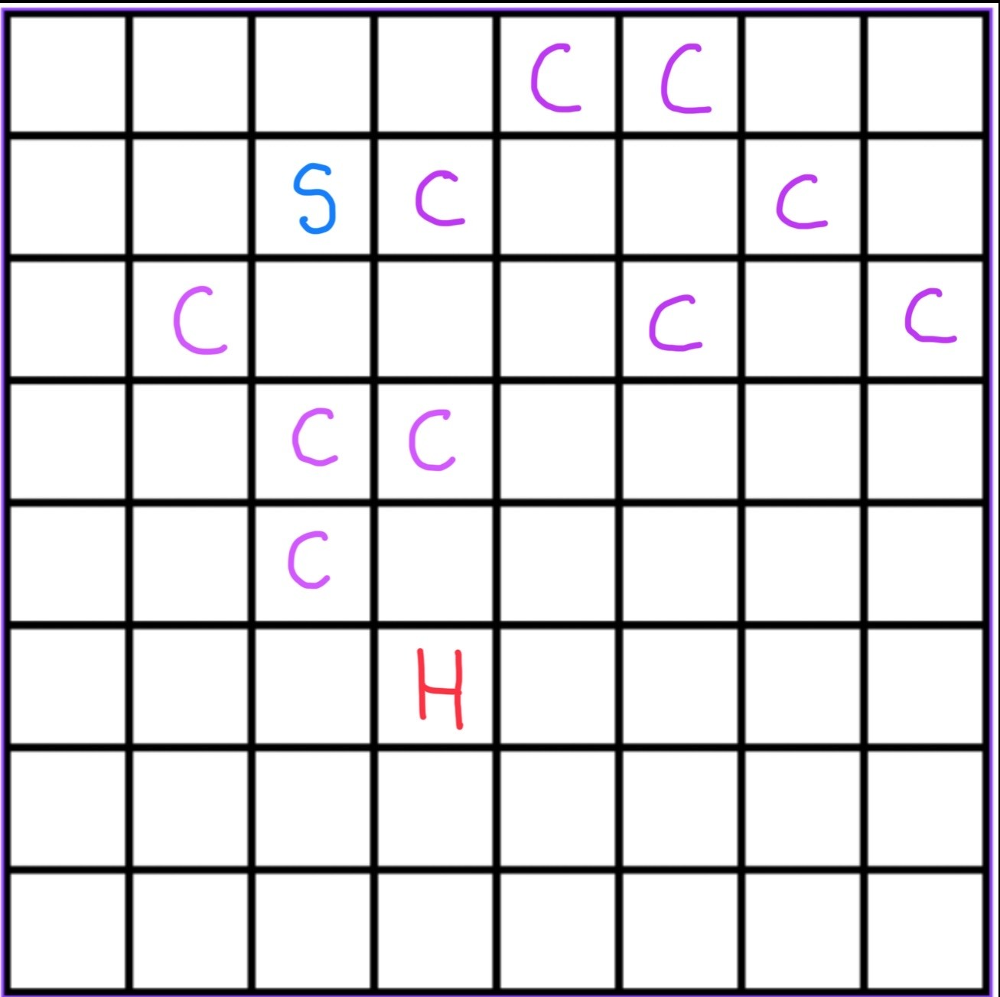

## Creating the Grid 

Here in this markdown file I will provide the step by step documentation on how I created my grid for my project 

### 1. Annotated Map 
Firstly using the metropolitan police website I annotated on the borough map everywhere there is a registered camera, I then cross referenced this by using a website online that also has where the speed cameras across the whole country are.

### 2. Adding a 8x8 Grid 
I then placed an 8x8 grid on top of the annotated map, these are the measurements I will use in my program 

### 3. Labelling the Annotated Map
I then labelled the grid. The H stands for Hospital which is the goal state, the C stands for Camera, these are the cells which have the speed cameras we're trying to avoid and lastly S stands for Start, our initial starting point/state

### 4. The Grid Itself
To make the grid more readable I decided to remove the map behind it. We are now left with the structure of the state space 
* In the real thing to help with readability I made my rows ABCDEFGH

